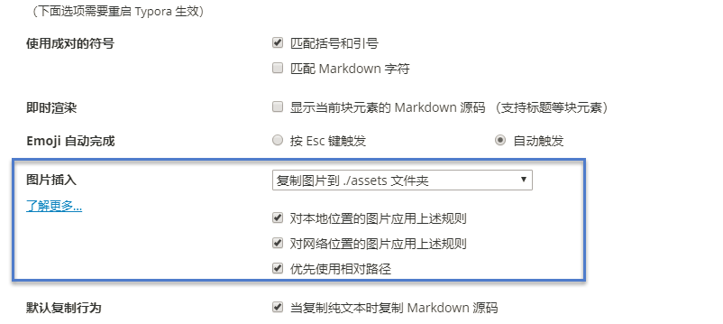

# Typora

一个超强超强强强强强强的markdown文本编辑器

## 1. 插入图片设置

简单如下设置，将在每个文件夹下创建一个assets目录用于保存该目录下所有文件所使用到的图片，可以直接复制粘贴，无需将图片、截图保存为本地文件再导入

路径：文件 -> 偏好设置

## 2. 常用快捷键

插入表格：ctrl + T

插入代码块：ctrl + shift + K

插入公式块：ctrl + shift + M

引用：ctrl + shift + Q

n级标题：ctrl + n               <!--n=1、2、3、4、5，为0时表示段落正文-->

有序列表：ctrl + shift + [

无序列表：ctrl + shift + ]

超链接：ctrl + K

图像：ctrl + shift + I

