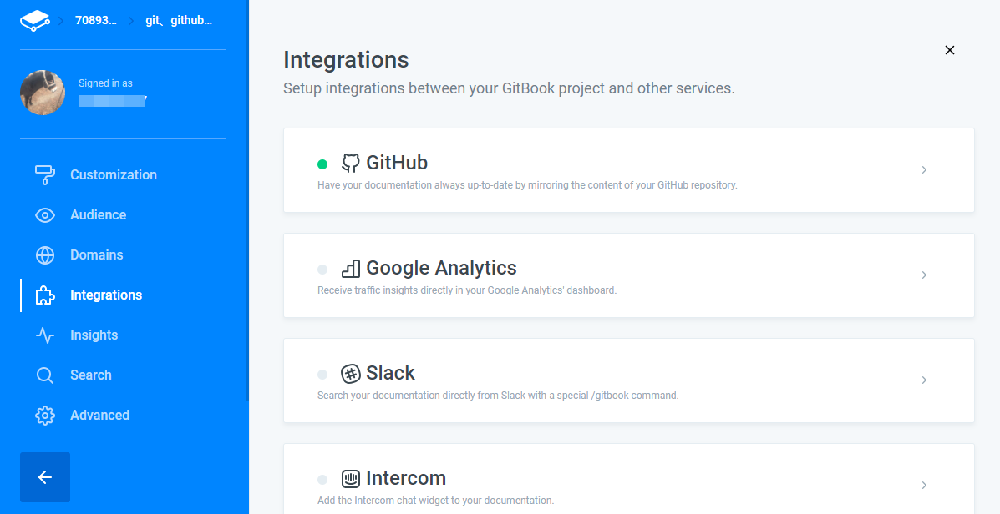

# gitbook的使用

GitBook 是一个基于 Node.js 的命令行工具，支持 Markdown 和 AsciiDoc 两种语法格式，可以输出 HTML、PDF、eBook 等格式的电子书。所以我更喜欢把 GitBook 定义为文档格式转换工具。

所以，GitBook 不是 Markdown 编辑工具，也不是 Git 版本管理工具。市面上我们可以找到很多 Markdown 编辑器，比如 Typora、MacDown、Bear、MarkdownPad、MarkdownX、JetBrains’s IDE（需要安装插件）、Atom、简书、CSDN 以及 GitBook 自家的 GitBook Editor 等等。

但 GitBook 又与 Markdown 和 Git 息息相关，因为只有将它们结合起来使用，才能将它们的威力发挥到极致！因此，通常我们会选择合适的 Markdown 编辑工具以获得飞一般的写作体验；使用 GitBook 管理文档，预览、制作电子书；同时通过 Git 管理书籍内容的变更，并将其托管到云端（比如 GitHub、GitLab、码云，或者是自己搭建的 Git 服务器），实现多人协作。

## 1. 搭建 GitBook 环境

因为 GitBook 是基于 Node.js，所以我们首先需要安装 Node.js

下载地址：https://nodejs.org/en/download/

现在安装 Node.js 都会默认安装 npm（node 包管理工具），所以我们不用单独安装 npm，打开命令行，执行以下命令安装 GitBook：

```shell
npm install -g gitbook-cli
```

安装完之后，就会多了一个 gitbook 命令

## 2. gitbook使用

创建一个新的文件夹mybook

使用shell命令cd到该文件夹路径下

```shell
$gitbook init
```

执行完后，你会看到多了两个文件 —— README.md 和 SUMMARY.md，它们的作用如下：

- README.md —— 书籍的介绍写在这个文件里
- SUMMARY.md —— 书籍的目录结构在这里配置

预览书籍：执行gitbook serve后，默认转换为html格式，进入http://localhost:4000/进行预览

```bash
$gitbook serve
```

构建书籍

```bash
$gitbook build
```

### 3. 使用github进行在线发布

将制作好的gitbook使用github desktop将电子书所在文件夹推送到github远程仓库

登录gitbook：https://www.gitbook.com/

Create a new space，填写大致信息后，在Integrations配置中绑定自己的github仓库



### 4. 步骤概括

1. 安装git，使用git bash或git desktop创建一个本地仓库，例如F:\git\gitstudy文件夹（在此文件夹下会产生.git的隐藏文件夹，即为本地仓库）
2. 使用gitbook init命令将该文件夹初始化，产生README.md 和 SUMMARY.md文件
3. 使用Typora打开该文件夹进行新建笔记章节等markdown格式文件，并进行排版
4. 使用github desktop将本地仓库push到github上
5. 以github账户登录gitbook，新建一个space，关联github远程仓库，并作一些简单配置，**完成发布**
6. Typora修改markdown文件，再次使用gitbook init和gitbook build命令更新电子书文件
7. 重复步骤4

